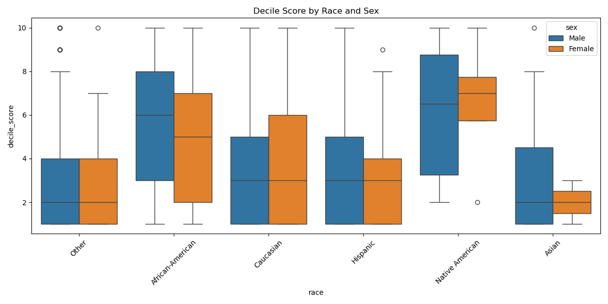
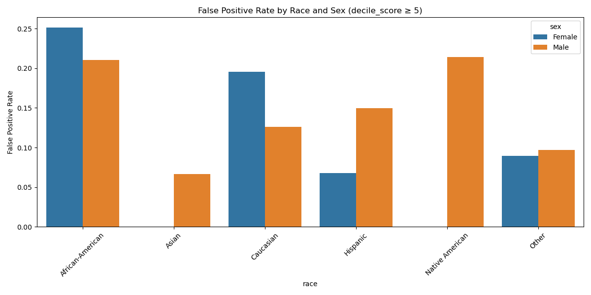
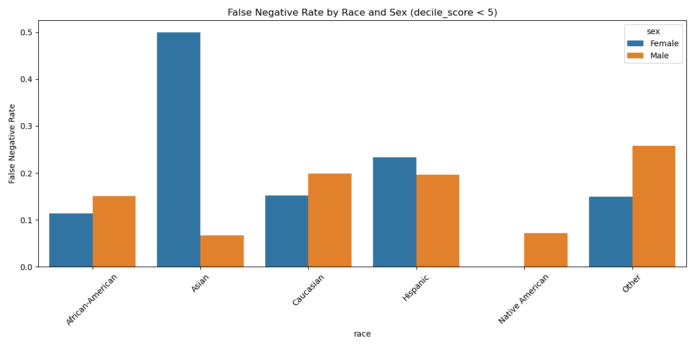

# Bias Analysis on the COMPAS Dataset - Group 3 (Una Europa Challenge)

> **This repository is a fork of the original ProPublica COMPAS analysis repository.**  
> The original project and dataset are available [here](https://github.com/propublica/compas-analysis).

> Source code for **Group 3**'s project in the Una Europa Challenge: *Data Science and AI for Social Welfare* is available [here](https://github.com/banafshebamdad/compas-analysis/tree/master/DSAL_Madrid).

## Project overview

This repository contains Group 3’s analysis of the COMPAS recidivism risk scoring algorithm, with a focus on identifying and mitigating algorithmic bias, particularly racial and gender bias. The project consists of:

1. **Exploratory bias analysis**: measuring disparities in risk scores, false positives, and false negatives.
2. **Bias mitigation via reweighing**: applying the AIF360 fairness algorithm to reduce racial bias in predictions.

## 1. Exploratory bias analysis

### Summary
We investigated whether COMPAS disproportionately classifies certain demographic groups (e.g. African-Americans) as high risk. The analysis shows evidence of **racial and gender bias**, even when individuals have similar recidivism behavior.

### Key Findings

#### Disparities in Risk Scores
- African-American individuals tend to receive **higher** decile scores than Caucasians.
- Similar recidivism rates do **not** explain these differences.

#### False Positive & False Negative Rates
- **FPR**: African-American females – 25.2%, vs. Caucasian females – 19.6%.
- **FNR**: Caucasian females – 15.2%, African-American males – 15.0%.
- Small groups like Asian females showed instability (FNR = 50%).

### Visual Evidence

- **Decile score distribution by race and sex**  
  

- **False positive rate by race and sex**  
  

- **False negative rate by race and sex**  
  

## 2. Bias mitigation via reweighing (pre-processing)

### Method
We applied the Reweighing algorithm from [AIF360](https://aif360.readthedocs.io/) toolkit to address racial bias by adjusting instance weights during training. The analysis was conducted on our cleaned and preprocessed COMPAS dataset, in which categorical features like race and sex were transformed into a suitable format for fairness evaluation.

- Trained an XGBoost model before and after mitigation.
- Evaluated using:
  - **Statistical parity difference**: Difference in the rate of favorable outcomes between unprivileged and privileged groups. Closer to 0 means fairer treatment.
  - **Disparate impact**: Ratio of favorable outcome rates between groups. A value close to 1.0 indicates fairness.
  - **Accuracy**: The proportion of correct predictions made by the model.

### Results

| Metric                       | Before reweighing (XGBoost) | After reweighing (XGBoost) |
| ---------------------------- | ----------------- | ---------------- |
| Accuracy                 | 0.683             | 0.672            |
| Statistical parity diff. | -0.261 (biased)   | -0.068 (fairer)  |
| Disparate impact         | 0.652 (biased)    | 0.892 (near 1.0) |
| Equal opportunity diff.  | -0.198            | -0.010           |
| Average odds diff.       | -0.220            | -0.026           |

### Interpretation
* A statistical parity difference near 0 and disparate impact near 1.0 suggest significant fairness improvement after applying reweighing.
* The accuracy is nearly unchanged, indicating bias was reduced without sacrificing performance.

### Visualizations

- **Statistical Parity Difference**  
  

- **Disparate Impact**  
  

### Conclusion
The reweighing algorithm successfully **reduced racial bias** in the model’s predictions while maintaining predictive accuracy.
